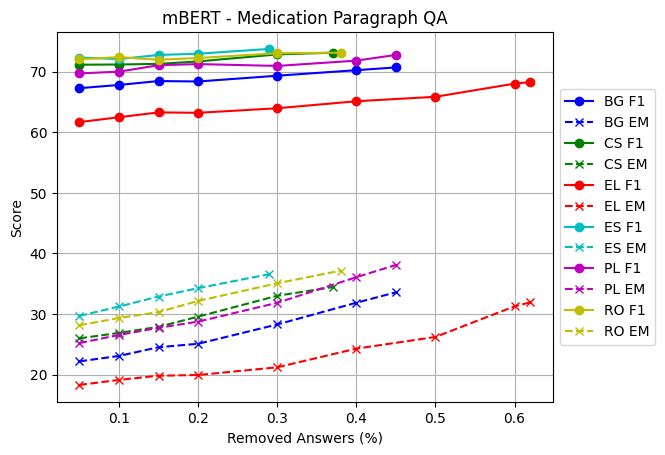
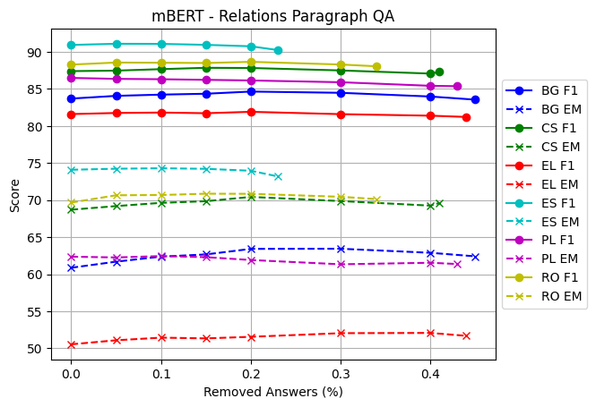

# CS-PL-SP-RM-emrQA


## Machine Translation 

### MT Model Statistics - khresmoi
The 48GB RAM node was used. Only NLLB-54B, MadLad10B and MadLad7B models are larger than the GPU free space -> load_in_4bit=True, torch_dtype=torch.float16 parameters are set while loading the model. 

We translated the english dataset into the target languages by batches of 50 sentences. That make the translation 20x faster than translating sentence by sentence.

For the evaluation, we used the ***khresmoi dataset*** (1500 medical setences translated by professionalists from the english to the cs, de, fr, hu, pl, es, sv)

The final and most accurate results are stored in the ```scripts/slurm_outputs/measure_translators.out``` file. The json output is in the file ```scripts/slurm_outputs/translator_results.json```. Rounded values are in the tables below.. 

Average table contains LINDAT averaged over only four languages (CS, DE, FR, PL) since LINDAT doesn't know SV, SE, HU. The ```scripts/slurm_outputs/translator_results.json``` file is averaged over all languages. 


|     AVERAGE          |   NLLB_600M |   NLLB_1_3B_dis |   NLLB_1_3B |   MadLad_3B |   NLLB_3_3B |   LINDAT |   MadLad_7B |   MadLad_10B |   NLLB_54B |
|:---------------------|------------:|----------------:|------------:|------------:|------------:|---------:|------------:|-------------:|-----------:|
| loading time (s)     |       6.49  |         20.02   |     20.05   |     18.04   |     40.13   |     0    |    471.67   |     601.76   |  3861.49   |
| translation time (s) |      33.6   |         54.98   |     55.81   |     98.96   |     84.64   |   838.62 |    302.84   |     326.79   |   956.99   |
| bleu                 |      31.66  |         34.19   |     33.9    |     37.68   |     35.14   |    33.74 |     37.65   |    **37.77** |    36.2    |
| meteor               |       0.567 |          0.5911 |      0.5895 |      0.6258 |      0.6022 |     0.59 |      0.6264 |    **0.6267**|     0.6102 |
| wer                  |      52.9   |         50.63   |     50.76   |     47.15   |     49.82   |    50.75 |     47.44   |    **46.98** |    48.75   |
| cer                  |      39.31  |         37.68   |     37.94   |     35.15   |     36.93   |    37.73 |     35.27   |    **34.94** |    36.14   |

|  EN -> CS (1500 sens)|   NLLB_600M |   NLLB_1_3B_dis |   NLLB_1_3B |   MadLad_3B |   NLLB_3_3B |   LINDAT |   MadLad_7B |   MadLad_10B |   NLLB_54B |
|:---------------------|------------:|----------------:|------------:|------------:|------------:|---------:|------------:|-------------:|-----------:|
| translation time (s) |      33.31  |         51.62   |     51.31   |     95.37   |     81.49   | 798.94   |    295.92   |     323.23   |    922.34  |
| bleu                 |      28.87  |         34.65   |     33.02   |     38.85   |     35.04   |  39.04   |     38.77   |    **39.28** |     38.23  |
| meteor               |       0.544 |          0.5911 |      0.5837 |      0.6367 |      0.6018 |   0.6337 |      0.6341 |    **0.6394**|      0.623 |
| wer                  |      55.41  |         50.35   |     51.62   |     45.91   |     49.97   |**45.56** |     46.15   |      45.61   |     47.28  |
| cer                  |      41.1   |         37.7    |     38.81   |     34.71   |     37.32   |  34.55   |     35.01   |    **34.38** |     35.36  |

|  EN -> DE (1500 sens)|   NLLB_600M |   NLLB_1_3B_dis |   NLLB_1_3B |   MadLad_3B |   NLLB_3_3B |   LINDAT |   MadLad_7B |   MadLad_10B |   NLLB_54B |
|:---------------------|------------:|----------------:|------------:|------------:|------------:|---------:|------------:|-------------:|-----------:|
| translation time (s) |     29.21   |          49.26  |     49.54   |      96.25  |     86.63   | 840.16   |     299.54  |     326.04   |  1024.32   |
| bleu                 |     30.08   |          31.3   |     31.4    |      34.43  |     32.59   |  30.77   |      34.47  |    **34.7**  |    33.46   |
| meteor               |      0.5732 |           0.585 |      0.5839 |       0.611 |      0.5949 |   0.5785 |    **0.613** |       0.6101 |     0.5992 |
| wer                  |     52.18   |          51.14  |     51.33   |  **49.03**  |     50.95   |  52.69   |      49.16  |    **49.03** |    50.36   |
| cer                  |     38.48   |          37.6   |     37.88   |    35.94    |     37.44   |  38.24   |      36.07  |    **35.78** |    37.19   |

|  EN -> FR (1500 sens)|   NLLB_600M |   NLLB_1_3B_dis |   NLLB_1_3B |   MadLad_3B |   NLLB_3_3B |   LINDAT |   MadLad_7B |   MadLad_10B |   NLLB_54B |
|:---------------------|------------:|----------------:|------------:|------------:|------------:|---------:|------------:|-------------:|-----------:|
| translation time (s) |      33.62  |         51.32   |     51.68   |     99.54   |     89.56   | 937.41   |    310.4    |     339.98   |   1039.16  |
| bleu                 |      46.67  |         47.65   |     48.17   |     49.21   |     47.99   |  47.28   |     48.93   |   **49.88**   |     48.3   |
| meteor               |       0.713 |          0.7188 |      0.7224 |      0.7307 |      0.7218 |   0.7144 |      0.7305 |   **0.7364** |      0.723 |
| wer                  |      41.43  |         40.67   |     39.93   |     40.33   |     40.68   |  39.65   |     41.03   |    **39.46** |     40.65  |
| cer                  |      27.82  |         27.01   |     26.94   |     26.72   |     27.17   |  27.9    |     26.87   |    **26.4**  |     26.84  |

|  EN -> HU (1500 sens)|   NLLB_600M |   NLLB_1_3B_dis |   NLLB_1_3B |   MadLad_3B |   NLLB_3_3B |   LINDAT |   MadLad_7B |   MadLad_10B |   NLLB_54B |
|:---------------------|------------:|----------------:|------------:|------------:|------------:|---------:|------------:|-------------:|-----------:|
| translation time (s) |     35.9    |         68.16   |     55.54   |    127.29   |     89.52   |        - |    313.19   |      351.09  |   949.36   |
| bleu                 |     13.04   |         15.8    |     15.29   |     19.41   |     16.96   |        - |   **20.48** |       19.94  |    18.91   |
| meteor               |      0.3577 |          0.3948 |      0.3899 |      0.4403 |      0.4114 |        - |   **0.4517**|        0.448 |     0.4317 |
| wer                  |     72.66   |         69.78   |     69.62   |     65.37   |     68.37   |        - |     64.89   |     **64.43**|    65.93   |
| cer                  |     56.87   |         55.27   |     54.9    |     52.33   |     53.62   |        - |     51.33   |     **51.29**|    51.73   |

|  EN -> PL (1500 sens)|   NLLB_600M |   NLLB_1_3B_dis |   NLLB_1_3B |   MadLad_3B |   NLLB_3_3B |   LINDAT |   MadLad_7B |   MadLad_10B |   NLLB_54B |
|:---------------------|------------:|----------------:|------------:|------------:|------------:|---------:|------------:|-------------:|-----------:|
| translation time (s) |     45.09   |           69.6  |      93.33  |    102.33   |     90.5    | 777.98   |    320.2    |     350.61   |  1016.16   |
| bleu                 |     14.97   |           17.37 |      16.94  |     20.46   |     18.41   |  17.87   |   **20.95** |      20.5    |    19.24   |
| meteor               |      0.3786 |            0.41 |       0.407 |      0.4545 |      0.4264 |   0.4163 |  **0.4598** |       0.4546 |     0.4368 |
| wer                  |     70.64   |           66.7  |      68.07  |     62.33   |     65.36   |  65.1    |   **61.8**  |      62.1    |    63.98   |
| cer                  |     55.53   |           52.33 |      53.83  |     48.11   |     50.73   |  50.24   |   **47.67** |      47.9    |    49.55   |

|  EN -> ES (1500 sens)|   NLLB_600M |   NLLB_1_3B_dis |   NLLB_1_3B |   MadLad_3B |   NLLB_3_3B |   LINDAT |   MadLad_7B |   MadLad_10B |   NLLB_54B |
|:---------------------|------------:|----------------:|------------:|------------:|------------:|---------:|------------:|-------------:|-----------:|
| translation time (s) |     27.08   |         45.81   |     45.87   |     87.71   |     80.15   |        - |    278.2    |     305.52   |   921.33   |
| bleu                 |     46.09   |         47.62   |     47.19   |   **49.05** |     48.05   |        - |     48.55   |      48.27   |    47.98   |
| meteor               |      0.7364 |          0.7462 |      0.7476 |  **0.7596** |      0.7534 |        - |      0.7555 |       0.7545 |     0.7505 |
| wer                  |     37.85   |         37.12   |     37.44   |   **35.7**  |     36.84   |        - |     36.27   |      36.48   |    36.7    |
| cer                  |     26.41   |         26.3    |     26.47   |  **25.19**  |     26.05   |        - |     25.72   |      25.69   |    26.12   |

|  EN -> SV (1500 sens)|   NLLB_600M |   NLLB_1_3B_dis |   NLLB_1_3B |   MadLad_3B |   NLLB_3_3B |   LINDAT |   MadLad_7B |   MadLad_10B |   NLLB_54B |
|:---------------------|------------:|----------------:|------------:|------------:|------------:|---------:|------------:|-------------:|-----------:|
| translation time (s) |     31      |          49.1   |      43.37  |     84.19   |     74.63   |        - |    302.41   |     291.06   |   826.25   |
| bleu                 |     41.93   |          44.95  |      45.31  |    **52.34**|     46.97   |        - |     51.42   |      51.82   |    47.26   |
| meteor               |      0.6658 |           0.692 |       0.692 |    **0.748**|      0.7059 |        - |      0.7402 |       0.7437 |     0.7071 |
| wer                  |     40.1    |          38.63  |      37.32  |    **31.4** |     36.55   |        - |     32.76   |      31.78   |    36.34   |
| cer                  |     28.93   |          27.54  |      26.77  |    **23.07**|     26.17   |        - |     24.21   |      23.14   |    26.2    |


## Evidence Alignment

When Prompting the translation (using medical message) some of paragraphs needed to be translated via DeepL / Google Translator


|  Medication                           |          |
|---------------------------------------|----------|
| overall paragraph parts               | 6 268    | 
| overall paragraphs                    | 5 081    |
| number of answers                     | 254 875  |
| number of questions                   | 232 347  |


|  Medication                           | BG         | CS       | EL       | ES       | PL       | RO         |
|---------------------------------------|------------|----------|----------|----------|----------|------------|
| paragraph parts translated "manually" | 4 (0.06%)  | 1 (0.02%)|197(3.14%)| 0 (0.00%)| 3 (0.05%)| 3 (0.05%)  |
| paragraphs translated "manually"      | 4 (0.08%)  | 1 (0.02%)| -        | 0 (0.00%)| 3 (0.06%)| 3 (0.06%)  |
| answers in affected paragraphs        | 789 (0.31%)| 0 (0.00%)| -        | 0 (0.00%)| 0 (0.00%)| 471 (0.18%)|
| questions in affected paragraphs      | 704 (0.30%)| 0 (0.00%)| -        | 0 (0.00%)| 0 (0.00%)| 407 (0.18%)|
| answers in affected parts             | 245 (0.10%)| 0 (0.00%)| -        | 0 (0.00%)| 0 (0.00%)| 5 (0.00%)  |
| questions in affected parts           | 222 (0.10%)| 0 (0.00%)| -        | 0 (0.00%)| 0 (0.00%)| 5 (0.00%)  |


|  Relations                            |            |
|---------------------------------------|------------|
| overall paragraph parts               | 11 054     | 
| overall paragraphs                    | 9 482      |
| number of answers                     | 1 021 514  |
| number of questions                   | 987 965    |

|  Relations                            | BG         | CS         | EL       | ES       | PL          | RO         |
|---------------------------------------|------------|------------|----------|----------|-------------|------------|
| paragraph parts translated "manually" | 2 (0.02%)  | 6 (0.05%)  |215(1.94%)| 0 (0.00%)| 4 (0.04%)   | 1 (0.01%)  |
| paragraphs translated "manually"      | 2 (0.02%)  | 6 (0.06%)  | -        | 0 (0.00%)| 4 (0.04%)   | 1 (0.01%)  |
| answers in affected paragraphs        | 547 (0.05%)| 445 (0.04%)| -        | 0 (0.00%)| 1036 (0.10%)| 0 (0.00%)  |
| questions in affected paragraphs      | 547 (0.06%)| 445 (0.05%)| -        | 0 (0.00%)| 1020 (0.10%)| 0 (0.00%)  |
| answers in affected parts             | 324 (0.03%)| 222 (0.02%)| -        | 0 (0.00%)| 565 (0.06%) | 0 (0.00%)  |
| questions in affected parts           | 324 (0.03%)| 222 (0.02%)| -        | 0 (0.00%)| 549 (0.06%) | 0 (0.00%)  |


### Medication

|   Awesome                | BG       | CS       | EL       | ES       | PL       | RO       |
|--------------------------|----------|----------|----------|----------|----------|----------|
| f1                       |**89.15** |**92.97** | 76.20    |**96.26** | 90.64    |**93.75** |
| exact match              |**59.26** |**66.79** | 36.52    |**72.93** |**58.80** |**68.04** |
| exact submatch           | 88.88    | 88.54    | 85.46    | 93.33    | 87.01    | 92.58    |
| f1 span                  |**88.83** |**92.84** | 75.71    |**96.09** |**90.45** |**93.45** |
| precision span           | 85.74    | 91.02    | 70.02    | 94.59    | 87.84    | 91.16    |
| recall span              | 98.06    | 98.06    | 96.76    | 99.08    | 98.00    | 98.77    |
| start distance           | -10.73   | -4.71    |-29.83    | -2.27    | -8.65    | -5.17    |
| middle distance          | 0.37     | 1.07     |-0.34     | 0.52     | 0.36     | 0.52     |
| end distance             | 11.48    | 6.84     | 29.15    | 3.31     | 9.36     | 6.20     |
| absolute start distance  | 12.52    | 7.32     | 32.92    | 3.41     | 10.01    | 6.47     |
| absolute middle distance | 9.44     | 6.35     | 21.21    | 3.21     | 7.98     | 5.44     |
| absolute end distance    | 12.64    | 7.91     | 30.81    | 3.86     | 10.53    | 6.89     |


|   FastAlign              | BG       | CS       | EL       | ES       | PL       | RO       |
|--------------------------|----------|----------|----------|----------|----------|----------|
| f1                       | 88.91    | 91.38    |**87.86** | 93.78    |**90.75** | 89.55    |
| exact match              | 41.04    | 53.09    |**41.85** | 56.31    | 50.08    | 35.66    |
| exact submatch           | 67.34    | 77.16    | 70.74    | 82.42    | 76.67    | 58.55    |
| f1 span                  | 88.20    | 90.99    |**87.18** | 93.40    | 90.21    | 88.13    |
| precision span           | 88.32    | 90.17    | 87.13    | 92.10    | 89.26    | 90.90    |
| recall span              | 93.11    | 95.69    | 92.98    | 97.14    | 95.54    | 90.14    |
| start distance           | -4.82    | -4.42    | -4.51    | -2.64    | -5.80    | -1.34    |
| middle distance          | 1.90     | 1.42     | 2.81     | 1.15     | 1.14     | 2.50     |
| end distance             | 8.62     | 7.26     | 10.12    | 4.94     | 8.08     | 6.34     |
| absolute start distance  | 12.09    | 9.06     | 13.67    | 6.15     | 9.96     | 10.42    |
| absolute middle distance | 9.95     | 7.88     | 11.22    | 5.39     | 8.49     | 8.55     |
| absolute end distance    | 11.52    | 9.33     | 13.17    | 6.27     | 10.14    | 9.72     |


|   Levenshtein            | BG       | CS       | EL       | ES       | PL       | RO       |
|--------------------------|----------|----------|----------|----------|----------|----------|
| f1                       | 75.13    | 82.06    | 72.23    | 82.94    | 79.85    | 81.31    |
| exact match              | 13.69    | 26.83    | 11.61    | 29.64    | 20.34    | 25.32    |
| exact submatch           | 64.23    | 75.47    | 56.58    | 78.39    | 72.47    | 74.21    |
| f1 span                  | 71.97    | 79.95    | 68.94    | 81.01    | 77.40    | 79.12    |
| precision span           | 66.21    | 73.70    | 63.97    | 74.41    | 70.48    | 72.89    |
| recall span              | 84.65    | 92.02    | 80.97    | 93.31    | 90.80    | 91.52    |
| start distance           | -20.83   | -13.91   | -16.96   | -14.02   | -19.70   | -16.12   |
| middle distance          | -8.17    | -2.66    | -4.49    | -2.35    | -7.29    | -3.90    |
| end distance             | 4.49     | 8.59     | 7.97     | 9.33     | 5.11     | 8.32     |
| absolute start distance  | 57.35    | 33.74    | 64.26    | 27.61    | 37.23    | 35.00    |
| absolute middle distance | 51.56    | 27.78    | 57.38    | 21.86    | 30.19    | 28.42    |
| absolute end distance    | 54.10    | 29.14    | 59.51    | 23.52    | 31.07    | 30.29    |


### Medication No Translation Prompt (straightforward translation)

|   Awesome                |    BG    |    CS    |    EL    |    ES    |    PL    |    RO    |
|--------------------------|----------|----------|----------|----------|----------|----------|
| f1                       |  82.90   |**89.82** |  70.27   |**93.71** |**89.33** |**90.88** |
| exact match              |**46.03** |**63.95** |  24.82   |**71.21** |**57.10** |**64.66** |
| exact submatch           |  81.72   |  85.12   |  80.42   |  91.20   |  85.20   |  90.54   |
| f1 span                  |**82.40** |**89.43** |  69.75   |**93.46** |**89.06** |**90.44** |
| precision span           |  79.63   |  88.51   |  63.75   |  92.44   |  86.70   |  88.42   |
| recall span              |  94.51   |  95.41   |  94.40   |  97.25   |  96.76   |  96.91   |
| start distance           |  -9.52   |  -2.78   | -31.90   |  -1.06   |  -7.23   |  -4.36   |
| middle distance          |   5.24   |   4.37   |   3.34   |   3.08   |   1.87   |   2.92   |
| end distance             |  20.01   |  11.51   |  38.57   |   7.22   |  10.97   |  10.19   |
| absolute start distance  |  22.37   |  12.52   |  41.29   |   8.56   |  11.85   |  10.88   |
| absolute middle distance |  18.06   |  10.77   |  28.34   |   7.74   |   9.66   |   9.43   |
| absolute end distance    |  22.68   |  13.24   |  41.36   |   8.40   |  12.50   |  11.41   |


|   FastAlign              |    BG    |    CS    |    EL    |    ES    |    PL    |    RO    |
|--------------------------|----------|----------|----------|----------|----------|----------|
| f1                       | **83.16**|   86.63  | **81.59**|   90.92  |   89.01  |   86.68  |
| exact match              |   32.05  |   50.00  | **28.56**|   54.63  |   48.27  |   34.19  |
| exact submatch           |   65.27  |   77.76  |   65.89  |   84.00  |   77.04  |   60.32  |
| f1 span                  |   82.38  |   86.02  | **80.89**|   90.49  |   88.41  |   85.30  |
| precision span           |   82.25  |   85.16  |   81.05  |   88.38  |   86.96  |   87.29  |
| recall span              |   90.65  |   93.93  |   89.63  |   96.98  |   95.23  |   89.84  |
| start distance           |   -4.82  |   -6.06  |   -2.13  |   -5.39  |   -7.00  |   -2.13  |
| middle distance          |    5.69  |    4.54  |    7.71  |    2.11  |    1.45  |    5.12  |
| end distance             |   16.21  |   15.14  |   17.55  |    9.61  |    9.89  |   12.38  |
| absolute start distance  |   19.94  |   18.03  |   22.30  |   10.27  |   12.61  |   16.79  |
| absolute middle distance |   16.23  |   14.48  |   18.46  |    8.23  |    9.80  |   13.42  |
| absolute end distance    |   19.91  |   17.65  |   22.18  |   10.98  |   11.99  |   15.78  |


|   Levenshtein            |    BG    |    CS    |    EL    |    ES    |    PL    |    RO    |
|--------------------------|----------|----------|----------|----------|----------|----------|
| f1                       |   71.53  |   79.90  |   68.35  |   81.60  |   78.72  |   79.40  |
| exact match              |   12.17  |   26.44  |    9.27  |   30.38  |   20.97  |   25.03  |
| exact submatch           |   61.46  |   69.94  |   52.94  |   76.10  |   70.32  |   71.43  |
| f1 span                  |   67.55  |   76.85  |   64.08  |   79.15  |   75.94  |   76.45  |
| precision span           |   61.41  |   71.31  |   58.64  |   73.05  |   69.22  |   70.58  |
| recall span              |   80.98  |   87.38  |   76.65  |   90.50  |   89.02  |   88.20  |
| start distance           |  -25.60  |  -12.13  |  -28.70  |  -15.96  |  -26.11  |  -15.03  |
| middle distance          |  -11.47  |   -1.79  |  -14.57  |   -4.68  |  -13.57  |   -2.95  |
| end distance             |    2.66  |    8.56  |   -0.45  |    6.60  |   -1.03  |    9.12  |
| absolute start distance  |   67.78  |   41.89  |   74.74  |   38.60  |   44.87  |   43.47  |
| absolute middle distance |   61.15  |   36.85  |   68.09  |   33.03  |   37.78  |   37.38  |
| absolute end distance    |   63.39  |   37.74  |   70.46  |   34.28  |   38.56  |   39.08  |


### Relations

|   Awesome                | BG       | CS       | EL       | ES       | PL       | RO       |
|--------------------------|----------|----------|----------|----------|----------|----------|
| f1                       | 89.37    | 93.19    | 79.73    |**97.03** | 90.11    |**94.30** |
| exact match              | **66.82**| **70.20**| 44.85    |**79.33** | 62.55    |**76.20** |
| exact submatch           | 88.12    | 82.56    | 84.83    | 84.23    | 81.83    | 88.91    |
| f1 span                  | 89.03    | 93.03    | 79.45    |**97.20** | 89.76    |**94.05** |
| precision span           | 86.89    | 92.41    | 74.46    | 97.39    | 88.30    | 93.18    |
| recall span              | 97.43    | 97.23    | 96.99    | 98.15    | 96.76    | 97.81    |
| start distance           | -12.49   | -5.11    |-23.88    | 1.35     | -8.71    | -2.85    |
| middle distance          | 0.56     | 1.54     |  3.60    | 2.70     | 1.56     | 2.44     |
| end distance             | 13.61    | 8.20     | 31.09    | 4.05     | 11.83    | 7.73     |
| absolute start distance  | 16.10    | 9.87     | 32.41    | 5.10     | 13.18    | 9.44     |
| absolute middle distance | 11.42    | 7.79     | 23.33    | 4.46     | 10.07    | 7.78     |
| absolute end distance    | 14.36    | 8.84     | 32.07    | 4.41     | 12.65    | 8.24     |


|   FastAlign              | BG       | CS       | EL       | ES       | PL       | RO       |
|--------------------------|----------|----------|----------|----------|----------|----------|
| f1                       | **92.88**|**94.04** |**92.06** | 95.34    |**93.87** | 91.89    |
| exact match              | 61.14    | 66.98    |**60.61** | 70.96    |**66.74** | 56.97    |
| exact submatch           | 77.95    | 80.92    | 78.46    | 83.81    | 80.77    | 71.67    |
| f1 span                  | **92.13**|**93.49** |**91.65** | 95.14    |**93.23** | 91.17    |
| precision span           | 92.27    | 93.58    | 91.47    | 94.77    | 93.48    | 92.42    |
| recall span              | 95.30    | 96.20    | 95.56    | 97.55    | 95.96    | 93.64    |
| start distance           | -3.77    | -2.67    | -3.58    | -1.99    | -3.88    | -2.63    |
| middle distance          | 0.72     | 1.44     | 1.92     | 1.21     | 0.60     | 1.90     |
| end distance             | 5.22     | 5.56     | 7.42     | 4.41     | 5.08     | 6.43     |
| absolute start distance  | 8.75     | 9.29     | 10.31    | 6.31     | 9.16     | 10.85    |
| absolute middle distance | 7.73     | 7.97     | 8.77     | 5.74     | 7.70     | 9.94     |
| absolute end distance    | 8.07     | 7.83     | 10.06    | 5.91     | 7.51     | 10.48    |

|   Levenshtein            | BG       | CS       | EL       | ES       | PL       | RO       |
|--------------------------|----------|----------|----------|----------|----------|----------|
| f1                       | 82.52    | 86.00    | 80.61    | 85.07    | 84.17    | 85.55    |
| exact match              | 26.84    | 32.26    | 23.65    | 33.24    | 27.58    | 34.03    |
| exact submatch           | 81.75    | 84.82    | 76.00    | 88.02    | 82.13    | 85.57    |
| f1 span                  | 80.46    | 83.80    | 78.08    | 82.93    | 81.99    | 83.60    |
| precision span           | 73.33    | 77.06    | 71.34    | 75.67    | 75.27    | 76.98    |
| recall span              | 92.84    | 94.99    | 90.03    | 95.69    | 93.23    | 95.04    |
| start distance           | -18.10   | -16.17   | -17.73   | -16.36   | -15.62   | -15.99   |
| middle distance          | -4.68    | -4.39    | -4.27    | -2.39    | -4.06    | -3.72    |
| end distance             | 8.74     | 7.39     | 9.19     | 11.57    | 7.51     | 8.55     |
| absolute start distance  | 32.18    | 26.81    | 43.21    | 28.16    | 30.29    | 26.42    |
| absolute middle distance | 23.84    | 19.50    | 34.75    | 19.56    | 23.20    | 18.94    |
| absolute end distance    | 23.53    | 18.79    | 34.05    | 19.55    | 22.47    | 18.57    |


### Relations No Translation Prompt (straightforward translation)

|   Awesome                |    BG    |    CS    |    EL    |    ES    |    PL    |    RO    |
|--------------------------|----------|----------|----------|----------|----------|----------|
| f1                       |   86.33  |   91.03  |   77.29  | **95.11**|   88.32  | **91.82**|
| exact match              | **60.73**| **65.96**|   40.21  | **77.01**|   59.52  | **72.34**|
| exact submatch           |   84.84  |   80.47  |   82.79  |   82.99  |   80.60  |   86.71  |
| f1 span                  |   85.98  |   90.82  |   76.98  | **95.18**|   87.92  | **91.48**|
| precision span           |   83.83  |   90.23  |   71.92  |   95.65  |   86.37  |   90.74  |
| recall span              |   95.37  |   95.68  |   95.84  |   96.41  |   95.57  |   95.99  |
| start distance           |   -8.79  |    0.16  |  -25.16  |    7.13  |   -5.94  |    0.98  |
| middle distance          |    5.17  |    7.49  |    5.00  |    8.47  |    5.02  |    7.29  |
| end distance             |   19.14  |   14.82  |   35.16  |    9.81  |   15.99  |   13.61  |
| absolute start distance  |   22.51  |   17.63  |   35.99  |   12.15  |   18.55  |   16.72  |
| absolute middle distance |   17.81  |   15.14  |   26.37  |   11.19  |   14.83  |   14.28  |
| absolute end distance    |   20.85  |   16.05  |   36.89  |   10.83  |   17.20  |   14.77  |


|   FastAlign              |    BG    |    CS    |    EL    |    ES    |    PL    |    RO    |
|--------------------------|----------|----------|----------|----------|----------|----------|
| f1                       |**89.87** |**91.49** |**91.06** |  93.57   |**92.21** |  89.95   |
| exact match              |  54.88   |  61.19   |**55.75** |  66.70   |**62.66** |  53.33   |
| exact submatch           |  77.43   |  79.82   |  76.58   |  84.59   |  80.14   |  72.04   |
| f1 span                  |**89.13** |**90.90** |**90.64** |  93.35   |**91.54** |  89.20   |
| precision span           |  88.85   |  90.57   |  90.21   |  92.20   |  91.50   |  89.93   |
| recall span              |  94.32   |  95.34   |  94.96   |  97.48   |  95.43   |  93.34   |
| start distance           |  -5.60   |  -2.99   |  -3.81   |  -4.13   |  -4.95   |  -5.16   |
| middle distance          |   1.57   |   3.68   |   1.61   |   1.16   |   1.08   |   1.65   |
| end distance             |   8.75   |  10.35   |   7.04   |   6.44   |   7.12   |   8.45   |
| absolute start distance  |  13.71   |  15.05   |  10.91   |   8.96   |  11.90   |  13.13   |
| absolute middle distance |  11.19   |  12.70   |   9.18   |   7.25   |   9.66   |  11.39   |
| absolute end distance    |  12.19   |  12.89   |  10.31   |   7.82   |   9.72   |  12.62   |


|   Levenshtein            |    BG    |    CS    |    EL    |    ES    |    PL    |    RO    |
|--------------------------|----------|----------|----------|----------|----------|----------|
| f1                       | 80.45    | 84.22    | 79.76    | 83.79    | 82.78    | 83.36    |
| exact match              | 25.59    | 30.82    | 22.78    | 33.64    | 27.29    | 32.34    |
| exact submatch           | 79.50    | 82.33    | 74.24    | 86.46    | 80.28    | 83.54    |
| f1 span                  | 77.98    | 81.83    | 77.17    | 81.39    | 80.39    | 81.00    |
| precision span           | 71.00    | 75.23    | 70.56    | 74.43    | 73.84    | 74.41    |
| recall span              | 90.17    | 92.82    | 88.82    | 93.63    | 91.35    | 92.43    |
| start distance           | -19.98   | -20.12   | -25.17   | -23.67   | -16.39   | -23.55   |
| middle distance          | -6.18    | -8.14    | -11.99   | -9.73    | -4.78    | -10.70   |
| end distance             | 7.63     | 3.85     | 1.18     | 4.21     | 6.83     | 2.15     |
| absolute start distance  | 42.84    | 35.80    | 43.99    | 38.07    | 36.29    | 40.39    |
| absolute middle distance | 34.34    | 28.62    | 35.66    | 29.51    | 29.37    | 32.67    |
| absolute end distance    | 33.67    | 27.92    | 34.79    | 29.39    | 28.80    | 32.11    |


## QA Full Reports
### Medication
| mBERT        | BG (AW)| CS (AW)| EL (FA)| EN     | ES (AW)| PL (AW)| RO (AW)|
|--------------|--------|--------|--------|--------|--------|--------|--------|
| EM           | 18.69  | 22.64  | 15.47  | 30.65  | 26.56  | 22.47  | 24.59  |
| F1           | 59.86  | 64.41  | 51.49  | 71.84  | 66.59  | 63.21  | 65.92  |

### Relations

| mBERT        |BG(AW) / BG(FA)|CS(AW) / CS(FA)| EL (FA)  | EN     | ES (AW)|PL(AW) / PL(FA)| RO (AW)  |
|--------------|---------------|---------------|----------|--------|--------|---------------|----------|
| EM           |54.06 / 50.38  |61.7 / 57.45   | 43.70    | 89.27  | 67.76  |52.98 / 55.2   | 63.95    |
| F1           |77.4 / 79.4    |81.35 / 81.99  | 73.49    | 95.57  | 86.08  |76.83 / 80.42  | 83.03    |


## Paragraph QA - Removed Answers Ratio
### Medication


### Relations



## Paragraph QA - Monolingual - full testset

### Medication
|    EM/F1    |      BG     |      CS     |      EL     |      EN     |      ES     |      PL     |      RO     |
|-------------|-------------|-------------|-------------|-------------|-------------|-------------|-------------|
| ClinicalBERT|20.09 / 64.19|23.89 / 67.75|15.66 / 57.07|31.38 / 73.99|27.44 / 70.35|22.96 / 66.32|26.12 / 69.39|
|     XLMR    | 21.8 / 67.35|25.23 / 70.93|18.08 / 61.55| 33.33 / 76.0|29.35 / 73.06|25.16 / 69.51|27.72 / 71.92|
|  XLMRLarge  | 23.1 / 69.0 |26.57 / 72.42| 19.11 / 63.6|33.95 / 77.37|29.73 / 74.22|25.45 / 70.95|28.36 / 73.49|
|    mBERT    |21.19 / 65.93|24.89 / 69.92|18.01 / 59.93|32.43 / 74.94|28.62 / 71.28|24.76 / 68.41|26.66 / 70.61|
|   mDistil   |19.69 / 63.23|22.95 / 65.91|16.47 / 57.12|30.53 / 72.24|26.29 / 68.44| 22.9 / 65.44|24.83 / 67.48|


#### Comparision of Correct Answers (EM) of All Language Pairs

|     | BG    | CS    | EL    | EN    | ES    | PL    | RO    |
|-----|-------|-------|-------|-------|-------|-------|-------|
| BG  | 100.0 | 70.71 | 60.06 | 70.51 | 70.38 | 71.32 | 71.36 |
| CS  | 70.71 | 100.0 | 58.74 | 77.41 | 76.85 | 75.68 | 76.15 |
| EL  | 60.06 | 58.74 | 100.0 | 62.04 | 60.43 | 60.03 | 60.35 |
| EN  | 70.51 | 77.41 | 62.04 | 100.0 | 83.33 | 76.86 | 81.16 |
| ES  | 70.38 | 76.85 | 60.43 | 83.33 | 100.0 | 76.82 | 80.34 |
| PL  | 71.32 | 75.68 | 60.03 | 76.86 | 76.82 | 100.0 | 77.43 |
| RO  | 71.36 | 76.15 | 60.35 | 81.16 | 80.34 | 77.43 | 100.0 |


### Relations
|    EM/F1    |      BG     |      CS     |      EL     |      EN     |      ES     |      PL     |      RO     |
|-------------|-------------|-------------|-------------|-------------|-------------|-------------|-------------|
| ClinicalBERT|57.84 / 81.31| 65.1 / 85.1 | 47.8 / 78.47|91.88 / 96.89|71.42 / 89.37|58.35 / 84.29|67.74 / 86.75|
|     XLMR    |60.68 / 84.24|68.54 / 87.71| 51.18 / 82.1|93.15 / 97.45| 74.01 / 91.3| 62.54 / 87.1| 70.2 / 88.94|
|  XLMRLarge  |63.31 / 85.81| 70.6 / 89.03|53.39 / 83.87|93.66 / 97.65| 74.03 / 90.9|65.22 / 88.46|72.09 / 89.93|
|    mBERT    |60.68 / 83.53|68.71 / 87.39| 50.94 / 81.7|92.79 / 97.22|73.52 / 90.73|61.82 / 86.29|70.16 / 88.36|
|   mDistil   | 58.6 / 81.91|66.17 / 85.36|48.54 / 79.36|91.03 / 96.22| 71.7 / 89.36|59.09 / 83.97|67.72 / 86.63|


#### Comparision of Correct Answers (EM) of All Language Pairs

|     | BG    | CS    | EL    | EN    | ES    | PL    | RO    |
|-----|-------|-------|-------|-------|-------|-------|-------|
| BG  | 100.0 | 74.73 | 63.27 | 76.69 | 73.64 | 68.15 | 75.30 |
| CS  | 74.73 | 100.0 | 64.81 | 82.39 | 77.53 | 72.14 | 78.47 |
| EL  | 63.27 | 64.81 | 100.0 | 68.91 | 67.10 | 66.70 | 65.48 |
| EN  | 76.69 | 82.39 | 68.91 | 100.0 | 85.93 | 77.72 | 83.56 |
| ES  | 73.64 | 77.53 | 67.10 | 85.93 | 100.0 | 73.74 | 79.41 |
| PL  | 68.15 | 72.14 | 66.70 | 77.72 | 73.74 | 100.0 | 72.80 |
| RO  | 75.30 | 78.47 | 65.48 | 83.56 | 79.41 | 72.80 | 100.0 |


## Paragraph QA - Monolingual - intersection testset

### Medication
|    EM/F1    |      BG     |      CS     |      EL     |      EN     |      ES     |      PL     |      RO     |
|-------------|-------------|-------------|-------------|-------------|-------------|-------------|-------------|
| ClinicalBERT|40.12 / 72.62|40.63 / 75.13|31.71 / 64.63|45.56 / 80.35|43.58 / 76.23|41.21 / 74.04| 41.8 / 75.51|
|     XLMR    |43.39 / 75.39| 43.21 / 78.6|36.26 / 70.89|47.98 / 81.43|45.91 / 78.71|44.44 / 77.14| 44.6 / 77.02|
|  XLMRLarge  |43.95 / 77.51|43.89 / 78.85|36.85 / 72.44|48.25 / 82.55| 46.24 / 79.7| 45.2 / 78.33|44.73 / 79.07|
|    mBERT    |41.68 / 73.98|42.98 / 77.27|34.49 / 69.52|46.82 / 80.96|43.79 / 77.17|42.86 / 75.64|44.32 / 77.09|
|   mDistil   |40.26 / 71.88| 40.1 / 73.69|32.25 / 64.91| 44.75 / 79.0|42.47 / 75.29|39.39 / 72.01|41.76 / 73.77|

#### Comparision of Correct Answers (EM) of All Language Pairs

|     | BG    | CS    | EL    | EN    | ES    | PL    | RO    |
|-----|-------|-------|-------|-------|-------|-------|-------|
| BG  | 100.0 | 82.87 | 74.38 | 85.36 | 83.02 | 81.53 | 83.99 |
| CS  | 82.87 | 100.0 | 73.67 | 86.35 | 84.10 | 82.60 | 84.25 |
| EL  | 74.38 | 73.67 | 100.0 | 76.34 | 73.97 | 74.04 | 74.84 |
| EN  | 85.36 | 86.35 | 76.34 | 100.0 | 87.52 | 85.35 | 86.66 |
| ES  | 83.02 | 84.10 | 73.97 | 87.52 | 100.0 | 83.07 | 86.24 |
| PL  | 81.53 | 82.60 | 74.04 | 85.35 | 83.07 | 100.0 | 84.28 |
| RO  | 83.99 | 84.25 | 74.84 | 86.66 | 86.24 | 84.28 | 100.0 |


### Relations
|    EM/F1    |      BG     |      CS     |      EL     |      EN     |      ES     |      PL     |      RO     |
|-------------|-------------|-------------|-------------|-------------|-------------|-------------|-------------|
| ClinicalBERT|72.79 / 87.52| 75.18 / 89.2|63.87 / 83.41|89.18 / 95.68|74.64 / 90.67|72.29 / 87.43|75.02 / 89.79|
|     XLMR    | 76.7 / 90.34|78.77 / 91.47|69.94 / 87.83|90.29 / 96.08|77.81 / 92.66|76.98 / 90.18|79.33 / 92.18|
|  XLMRLarge  |78.69 / 91.38| 80.3 / 92.48|71.37 / 88.75|91.11 / 96.55| 78.7 / 93.12|79.53 / 91.54|80.22 / 92.65|
|    mBERT    |76.89 / 89.79|78.68 / 91.15|69.89 / 87.15|89.83 / 95.87|76.47 / 91.73|76.95 / 89.79|77.59 / 91.16|
|   mDistil   |74.29 / 87.81|76.08 / 89.55|66.03 / 84.41|88.27 / 95.14| 74.9 / 90.45|73.53 / 87.22|75.85 / 89.68|


#### Comparision of Correct Answers (EM) of All Language Pairs

|     | BG    | CS    | EL    | EN    | ES    | PL    | RO    |
|-----|-------|-------|-------|-------|-------|-------|-------|
| BG  | 100.0 | 83.94 | 72.74 | 87.55 | 82.59 | 81.59 | 83.20 |
| CS  | 83.94 | 100.0 | 73.01 | 88.65 | 83.84 | 82.60 | 84.97 |
| EL  | 72.74 | 73.01 | 100.0 | 76.73 | 73.36 | 73.99 | 73.24 |
| EN  | 87.55 | 88.65 | 76.73 | 100.0 | 88.45 | 86.82 | 88.89 |
| ES  | 82.59 | 83.84 | 73.36 | 88.45 | 100.0 | 82.13 | 84.80 |
| PL  | 81.59 | 82.60 | 73.99 | 86.82 | 82.13 | 100.0 | 82.93 |
| RO  | 83.20 | 84.97 | 73.24 | 88.89 | 84.80 | 82.93 | 100.0 |


## Paragraph QA - Multilingual - intersection testset

### Medication
|    EM/F1    |      BG     |      CS     |      EL     |      EN     |      ES     |      PL     |      RO     |
|-------------|-------------|-------------|-------------|-------------|-------------|-------------|-------------|
| ClinicalBERT|41.74 / 75.78| 42.4 / 77.87| 37.11 / 71.6|46.24 / 81.43|44.23 / 78.99|43.28 / 77.08|44.26 / 78.66|
|     XLMR    | 45.58 / 78.5|44.94 / 80.34| 38.9 / 75.15|47.58 / 82.26|46.43 / 80.14| 46.4 / 79.37|45.78 / 79.46|
|  XLMRLarge  |46.24 / 79.65|45.17 / 80.66|39.11 / 75.14|47.69 / 82.43|46.71 / 80.49| 46.6 / 80.33|46.37 / 79.78|
|    mBERT    | 43.8 / 77.27|44.11 / 78.93|39.13 / 73.73|47.25 / 81.59|45.43 / 79.75|44.42 / 78.75|44.39 / 78.78|
|   mDistil   | 41.83 / 76.1|42.98 / 77.08|36.94 / 70.68|46.08 / 80.44|43.51 / 78.08|44.23 / 77.66|43.77 / 77.37|

### Relations
|    EM/F1    |      BG     |      CS     |      EL     |      EN     |      ES     |      PL     |      RO     |
|-------------|-------------|-------------|-------------|-------------|-------------|-------------|-------------|
| ClinicalBERT|74.04 / 87.99|76.24 / 90.04|66.01 / 84.84|88.03 / 95.54|75.46 / 91.03|74.42 / 88.45| 76.9 / 91.1 |
|     XLMR    | 78.22 / 90.9|80.29 / 92.41|70.55 / 88.79|90.43 / 96.33| 78.1 / 92.76|78.17 / 91.15| 79.75 / 92.7|
|  XLMRLarge  |79.17 / 91.65|79.89 / 92.34|72.32 / 89.57|90.58 / 96.51|79.35 / 93.58| 79.3 / 91.74|80.46 / 93.33|
|    mBERT    | 77.4 / 90.5 |78.74 / 91.68|70.96 / 88.43| 89.87 / 96.1|77.49 / 92.55|77.37 / 90.05|78.66 / 91.85|
|   mDistil   |76.68 / 89.49|77.82 / 90.76|68.57 / 86.42|88.64 / 95.54|75.89 / 91.39|76.12 / 89.25|78.06 / 91.07|


## EN Gold Data

### Medication
|    EM/F1    |   EM        |     F1      |
|-------------|-------------|-------------|
| ClinicalBERT|    31.39    |     74.21   |
|     XLMR    |    32.85    |     76.0    |
|    m-XLMR   |    33.36    |     77.46   |
|  XLMRLarge  |    33.66    |     77.63   |
|m-XLMRLarge  |    33.53    |     77.54   |
|    mBERT    |    32.57    |     75.07   |
|  m-mBERT    |    32.76    |     76.38   |
|   mDistil   |    30.35    |     71.64   |
|  m-mDistil  |    31.81    |     74.4    |

### Relations
|    EM/F1    |   EM        |     F1      |
|-------------|-------------|-------------|
| ClinicalBERT|    91.98    |     96.91   |
|     XLMR    |    93.27    |     97.5    |
|    m-XLMR   |    93.08    |     97.47   |
|  XLMRLarge  |    93.52    |     97.6    |
|m-XLMRLarge  |    93.42    |     97.63   |
|    mBERT    |    92.22    |     97.11   |
|  m-mBERT    |    92.46    |     97.19   |
|   mDistil   |    90.98    |     96.11   |
|  m-mDistil  |    91.26    |     96.55   |
