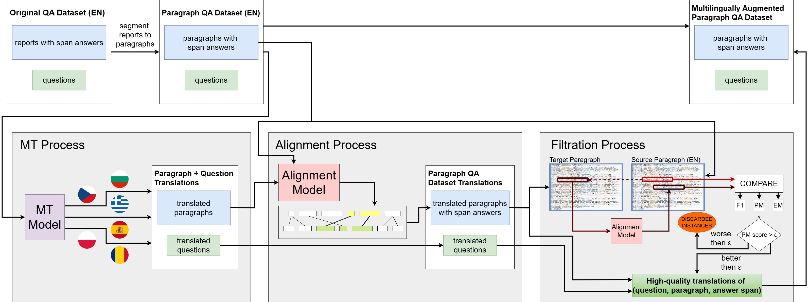

# Multilingual emrQA


This repository contains the source code for the CL4Health @ NAACL2025 paper [**When Multilingual Models Compete with Monolingual Domain-Specific Models in Clinical Question Answering**](https://aclanthology.org/2025.cl4health-1.6.pdf). 

### Overview
The paper explores the performance of general-domain multilingual models on the clinical Question Answering task using Medication and Relations subsets of emrQA. To improve model performance, we employ multilingual data augmentation, translating an English clinical QA dataset into six additional languages. Our approach involves a translation pipeline that translates report paragraphs and questions, projection of evidence (answers) into target languages, ensuring consistency in question-answer pairs across languages, and filtering out low-quality instances. We systematically evaluate several multilingual models fine-tuned in both mono- and multilingual settings.



For a detailed description of the pipeline, check the paper.


#### Key Findings

 - The translation process and subsequent QA experiments introduce unique challenges for each language.

 - Contrary to expectations, monolingual domain-specific pretraining does not always outperform general-domain multilingual pretraining on the original English test set.

 - Multilingual models exhibit strong potential for clinical support in languages lacking dedicated clinical NLP resources.


#### Performance comparison of clinical-domain monolingual and general-domain multilingual models

The following table compares BERTBase, medically pretrained BioBERT and clinically pretrained ClinicalBERT models with their multilingual counterpart, mBERT. The mBERT is evaluated in three different settings
 - w/o tgt: multilingually augmented training data exclude the original english data
 - mono: training data include only original english data
 - multi: training data include all multilingually augmented training data (english as well as all dataset translations)

| Model                |Medication EM | Medication F1| Relations EM| Relations F1|
|----------------------|--------------|--------------|-------------|-------------|
| BERTbase             | 31.0         | 72.9         | 91.1        | 96.2        |
| BioBERT              | 31.1         | 74.4         | 91.7        | 96.9        |
| ClinicalBERT         | 31.4         | 73.9         | 92.0        | 96.9        |
| mBERT (*w/o tgt*)    | 31.0         | 75.9         | 90.0        | 96.0        |
| mBERT (*mono*)       | 32.7         | 75.3         | **92.8**    | **97.3**    |
| mBERT (*multi*)      | **33.0**     | **76.7**     | 92.6        | **97.3**    |

For even more interesting observations and results, check the paper.


## How to run experiments
!!! Important !!! :

To run these experiments with the default arguments, ensure that the following folders exist in the root directory of this repository:

- `/data/`
  - `/data/translation_aligners`
  - `/data/translations`
- `/jsons/`
  - `/jsons/monolingual`
  - `/jsons/multilingual`
  - `/jsons/multilingual_wtgt`
  - `/jsons/paragraphs_thresholds`
- `/predictions/`
  - `/predictions/monolingual`
  - `/predictions/multilingual`

Also put the emrQA dataset as `data.json` file into the `/data/` directory. But you can specify the path differntly via script arguments.


#### To replicate paper experiments, run scripts in the following order
with arguments described below
1. `00_compare_translators.py`
2. `01_run_translation.py`
3. `02_run_alignment.py`
4. `03_run_report_qa.py`
5. `04_run_paragraph_qa.py`


For more details, review the particular scripts to examine the arguments and their associated options that are explicitly hardcoded within the argument parsing dictionaries under the 'ArgumentParser' part.

### `00_compare_translators.py`
The script `00_compare_translators.py` evaluates different translation models on a medical dataset ***khresmoi***. The script loads test data, applies the specified translation model and evaluate results.

#### Arguments
- data_dir: Path to the test dataset (default: ../datasets/khresmoi-summary-test-set-2.0).
- models_dir: Directory containing downloaded translation models (default: ../models).
- model: The translation model to use. Must be one of the supported models.
- seed: Random seed for reproducibility (default: 55).
- batch_size: Number of samples processed per batch (default: 50).

#### Supported Models
The following models are supported:
- `NLLB_600M`
- `NLLB_1_3B_dis`
- `NLLB_1_3B`
- `MadLad_3B`
- `NLLB_3_3B`
- `LINDAT`
- `MadLad_7B`
- `MadLad_10B`
- `NLLB_54B`

#### Example Command
```sh
python 00_compare_translators.py --data_dir ../datasets/khresmoi-summary-test-set-2.0 \
                              --models_dir ../models \
                              --model NLLB_600M \
                              --seed 55 \
                              --batch_size 50
```


### `01_run_translation.py`

The script `01_run_translation.py` translates paragraphs and questions from the **emrQA** English dataset into a specified target language. The output file (e.g. `./data/translations/medication_cs.json`) has similar format to the input file `./data/data.json`. Reports with their question-answer pairs are segmented and split into paragraphs, allowing us to work with them separately; these paragraphs are then translated into the target language. Each paragraph context is represented here as a list of paragraph parts—ideally containing only one item, the whole paragraph. Multiple parts appear only when the final paragraph is too long to ensure high-quality translation. Questions are just replaced by their translated versions. Answers stay the same in original language (English) with the offset span showing to the original paragraph (that are not part of the output file anymore) rather then to the new translated ones.

#### Arguments
- data_path: Path to the input emrQA dataset (default: ./data/data.json).
- output_dir: Directory to save translated data (default: ./data/translations).
- target_language: Target language for translation (default: cs).
- disable_prompting: If True, disables translation model prompting (disable PMP) (default: False).
- translated_medical_info_message: Custom message appended to translated medical data (default: "Na základě lékařských zpráv.").
- translation_model_path: Path to the translation model (default: ../models/madlad400-3b-mt).
- translation: If True, enables translation (default: False).
- topics: List of topics to translate (default: ["medication", "relations"]).
- seed: Random seed for reproducibility (default: 55).

#### Example Command
```bash
python 01_run_translation.py --data_path ./data/data.json \
                          --output_dir ./data/translations \
                          --target_language cs \
                          --translation_model_path ../models/madlad400-3b-mt \
                          --topics medication relations \
                          --translated_medical_info_message 'Na podstawie raportów medycznych.#Na podstawie sprawozdań lekarskich.'\
                          --seed 55
```


### `02_run_alignment.py`

The script `02_run_alignment.py` aligns answer spans from the original **emrQA** dataset to the translated paragraphs and questions. It computes alignment scores and confidence values for each aligned answer. The input file here is the output file from the previous stage `01_run_translation.py` (e.g. `./data/translations/medication_cs.json`) and the original dataset `./data/data.json`. The output file of this `02_run_alignment.py` script has then exactly the same format as `medication_cs.json` from previous stage. The only difference is that answers are now projected to the current translated paragraphs and also that each answer object containing fields `text` and `answer_start` also contains field `"scores": {"exact_match": .., "exact_submatch": .., "f1": .., "f1_span": .., .."` computed from the unsupervised forward-backward substring alignment evaluation method used for the filtration in the following stages `03_run_report_qa.py` and `04_run_report_qa.py`.


#### Arguments
- translation_dataset: Path to the translated dataset containing paragraphs and questions (default: ./data/translations/medication_cs.json).
- dataset: Path to the original emrQA dataset (default: ./data/data.json).
- output_dir: Directory to save aligned answer spans (default: ./data/translation_aligners).
- dataset_title: Title of the dataset being processed (default: "medication").
- language: Target language of the translated dataset (default: "cs").
- aligner_name: Name of the alignment model (default: "Awesome").
- aligner_path: Path to the alignment model (default: ../models/awesome-align-with-co).
- seed: Random seed for reproducibility (default: 55).

#### Example Command
```bash
python 02_run_alignment.py --translation_dataset ./data/translations/medication_cs.json \
                        --dataset ./data/data.json \
                        --output_dir ./data/translation_aligners \
                        --dataset_title medication \
                        --language cs \
                        --aligner_name Awesome \
                        --aligner_path ../models/awesome-align-with-co \
                        --seed 55
```


### `03_run_report_qa.py`

The script `03_run_report_qa.py` runs a QA experiment on both full reports and paragraph-level QA tasks. It also supports the removal of low-quality instances by specifying a threshold hyperparameter, allowing you to analyze its effect on QA performance.

#### Arguments
- `dataset`: Path to the dataset translation (default: `../datasets/emrQA/medication_bg.json`).
- `model_name`: Name of the model to use for QA (default: `ClinicalBERT`).
- `model_path`: Path to the model (default: `../models/Bio_ClinicalBERT`).
- `answers_remove_ratio`: Ratio of low-quality answers to remove (default: `0.0`).
- `train_sample_ratio`: Ratio of data to be used for training (default: `0.2`).
- `epochs`: Number of training epochs (default: `3`).
- `to_reports`: If `True`, runs the QA experiment on full reports (default: `False`).
- `paragraph_parts`: If `True`, includes paragraph-level segmentation (default: `False`).
- `seed`: Random seed for reproducibility (default: `2`).

#### Example Command
```bash
python 03_run_report_qa.py --dataset ../datasets/emrQA/medication_bg.json \
                       --model_name ClinicalBERT \
                       --model_path ../models/Bio_ClinicalBERT \
                       --answers_remove_ratio 0.1 \
                       --train_sample_ratio 0.2 \
                       --epochs 3 \
                       --to_reports True \
                       --paragraph_parts True \
                       --seed 2
```

### `04_run_paragraph_qa.py`

The script `04_run_paragraph_qa.py` is the final step of the paper, used to evaluate the performance of clinical and general-domain multilingual models on the Paragraph QA task. You can either use multilingual augmented data or fine-tune in a monolingual setting. The script evaluates both, the performance of model in an intersection test sets mode as well as in a full tests mode.

#### Arguments
- `subset`: Subset of the dataset (default: `medication`).
- `language`: Target language for the evaluation (default: `BG`).
- `model_name`: Name of the model to use for QA (default: `ClinicalBERT`).
- `model_path`: Path to the model (default: `../models/Bio_ClinicalBERT`).
- `train_sample_ratio`: Ratio of data used for training (default: `0.2`).
- `train_ratio`: Ratio of data used for training (default: `0.7`).
- `dev_ratio`: Ratio of data used for development/validation (default: `0.1`).
- `epochs`: Number of training epochs (default: `3`).
- `multilingual_train`: If `True`, uses multilingual augmented data for training (default: `False`).
- `remove_target_language_from_train`: If `True`, removes the target language data from the training set (default: `False`).
- `seed`: Random seed for reproducibility (default: `2`).

#### Example Command
```bash
python 04_run_paragraph_qa.py --subset medication \
                           --language BG \
                           --model_name ClinicalBERT \
                           --model_path ../models/Bio_ClinicalBERT \
                           --train_sample_ratio 0.2 \
                           --train_ratio 0.7 \
                           --dev_ratio 0.1 \
                           --epochs 3 \
                           --multilingual_train False \
                           --remove_target_language_from_train False \
                           --seed 2
```


## Citation

```bib
@inproceedings{lanz-pecina-2025-multilingual,
    title = "When Multilingual Models Compete with Monolingual Domain-Specific Models in Clinical Question Answering",
    author = "Lanz, Vojtech  and
      Pecina, Pavel",
    editor = "Ananiadou, Sophia  and
      Demner-Fushman, Dina  and
      Gupta, Deepak  and
      Thompson, Paul",
    booktitle = "Proceedings of the Second Workshop on Patient-Oriented Language Processing (CL4Health)",
    month = may,
    year = "2025",
    address = "Albuquerque, New Mexico",
    publisher = "Association for Computational Linguistics",
    url = "https://aclanthology.org/2025.cl4health-1.6/",
    pages = "69--82",
    ISBN = "979-8-89176-238-1",
}
```
